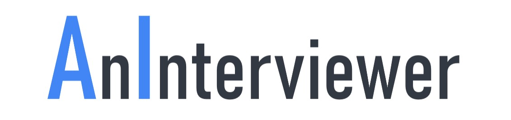

#


## Overview 🎥🤖

Welcome to **AnInterviewer AI Interview Assistant** – your ultimate companion for conducting AI-powered, dynamic interviews! This app brings together the power of **Flask** and **Gemini API** to create a seamless interview experience with **auto-generated questions**, **video responses**, and **AI-driven feedback**. Whether you're a recruiter or preparing for interviews, this app provides personalized, interactive interview experiences like never before! 


In today’s age of remote work and online interviews, we saw a gap – a tool that not only **prepares you for interviews** but also allows you to **simulate the experience** with **personalized questions and video recording**. We wanted to create something personal, user-friendly, and designed to replicate the real-world experience more closely.

Our goal was simple: **build an app** that helps you **practice your interviewing skills** with meaningful AI-driven feedback – just like feedback you’d expect from an experienced interviewer.

## Demo
[](https://www.youtube.com/watch?v=4f2cIyPz0Ic)

## Features 💡

- **Generate Custom Interview Questions**: Automatically generates interview questions based on job descriptions, complexity, and avatars using the Gemini API. 🖊️
- **Web Scraping for Job listings**: Supports webscraping for top job posting websites, as well as copy pasting of job descriptions.  💻
- **Interviewer Avatars**: Human avatars asking interview questions. 👩‍💻👨‍💼
- **Record Interview**: Records responses to interview questions via the web interface and save videos for analysis. 📹
- **AI-driven Feedback**: Gets detailed feedback on recorded responses regarding body language, communication, and relevance to the job description. 🧠
- **Background Processing**: Handles long-running operations (e.g., feedback generation) in the background to ensure smooth user experience.  🔄


## Prerequisites ⚙️
* **[Gemini API Key](https://ai.google.dev/gemini-api/docs/api-key)**
* **[Scrapfly API Key](https://scrapfly.io/dashboard)**
* **[D-iD API Key](https://docs.d-id.com/reference/get-started)**
* Flask
* Python 3.x
* Libraries in `requirements.txt`


## Installation & Usage ⚙️

1. **Clone the Repository:**

   ```bash
   git clone https://github.com/ieva_fil/interview_tool.git
   cd interview_tool

2. **Install Requirements:**
   ```bash
   pip install -r requirements.txt
   cd src

3. **Create an .env file in the src directory with your API keys:**
   ```bash
   # Gemini API key
   GEMINI_API_KEY=<INSERT_API_KEY>
   # Scrapfly API key
   SCRAPFLY_API_KEY=<INSERT_API_KEY>
   # D-iD API key
   DID_API_KEY=<INSERT_API_KEY>
   
4. **Run the application:**
   ```bash
   python app.py

5. **Navigate to http://127.0.0.1:5000/**


## Project Tree ⚙️

      ├── src
      │    ├── app.py                       # Main Flask application file
      │    ├── detect_link.py               # Detect corresponding links to job sites
      │    ├── gemini_service.py            # Interactions with the Gemini API for generating scripts, questions, and feedback
      │    ├── generate_avatar.py           # Generate a video of an avatar speaking the given input text
      │    ├── webscrape_jobs_indeed.py     # Retrieve the job title and description for an Indeed job.
      │    ├── webscrape_jobs_linkedin.py   # Retrieve the job title and description for an Linkedin job.
      │    ├── webscrape_jobs_totaljobs.py  # Retrieve the job title and description for an Totaljobs job.
      │    ├── static/
      │    │   └── videos/                  # Folder to store generated video files
      │    │   └── images/                  # Avatar and logo images
      │    │   └── style.css                # Application css
      │    ├── templates/                   # HTML templates
      │    │   ├── index.html               # Homepage template
      │    │   ├── loading.html             # Loading screen template for question generation
      │    │   ├── intro.html               # Introduction script template
      │    │   ├── record.html              # Template for recording responses
      │    │   ├── feedback.html            # Feedback display template
      │    │   ├── feedback_loading.html    # Feedback processing template
      │    │   └── error.html               # Error message template
      │    └── uploads/                     # Folder to store uploaded interview recording
      └── README.md
      └── requirements.txt


##### Developed by Michal Sawicki and Ieva Filinaite

